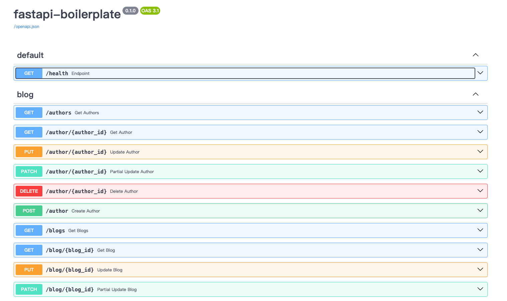

# fastapi-boilerplate

This is a boilerplate for building scalable and maintainable web APIs based on FastAPI.

See more details: [Documentation](docs/index.md)

## Tech Stack

- Web Framework: FastAPI
- GraphQL: strawberry, AuthX, fastapi-pagination, piccolo-api
- Socketio: python-socketio
- Validation: pydantic
- Database: tortoise-orm, aerich
- Configuration: dynaconf, pydantic-settings
- Task Queue: taskiq
- Authentication: AuthX, authlib
- Monitoring: grafana
- Logging: loguru
- Metrics: prometheus
- Testing: pytest, pytest-asyncio, pytest-cov, pytest-mock, locust
- Code Quality: black, isort, ruff, pre-commit

## Screenshots

### RESTful API(Swagger)

